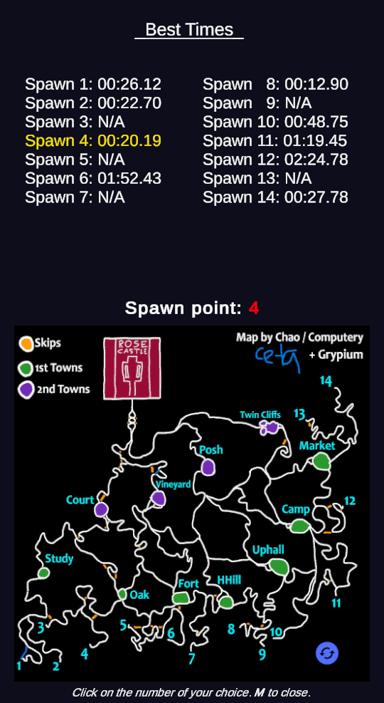
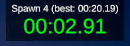

# Speedrun

🏎️ 🙈 Already practiced the Study route 1000x in custom, now thinking about doing it blindfolded ?

🐴 🛤️  What about **new routes** to practice instead ?

## Features

🗺️📍**Choose your starting point** from any of the 14 spawns before the game starts.

⏱️ **Includes a timer** to **monitor your speedrun time. Timer automatically stops when you enter Castle.

💾 **Records save system**. Keep track of your best score for each of the 14 spawns.

## Usage

Start a **custom game** (max 2 players) and select your spawn point by clicking on the map.

> Note: You can still play normal games even with this mod enabled. The custom map will only appear in custom.

## In-game UI

### Minimap & Best times

### Timer

 